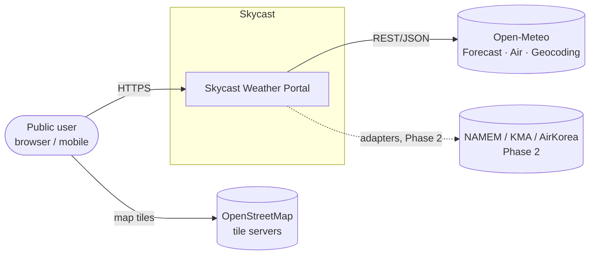
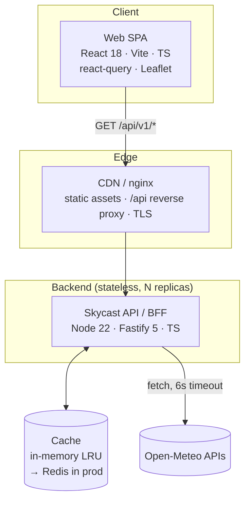
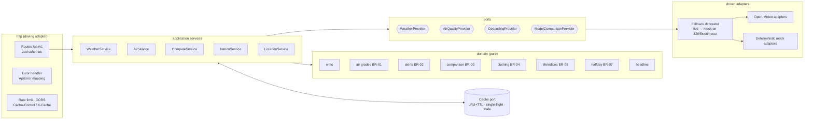
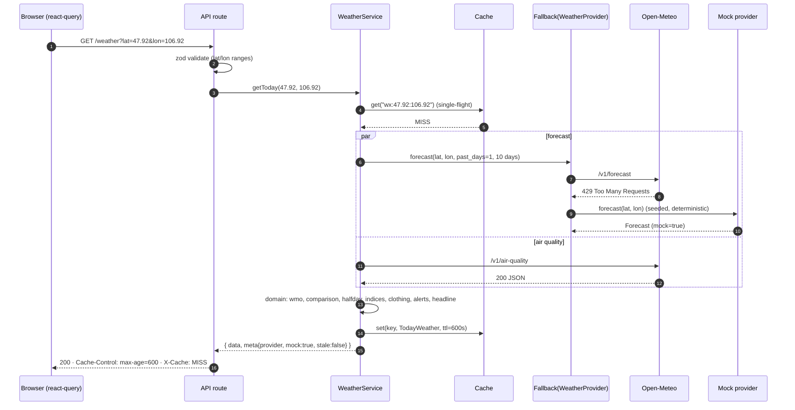
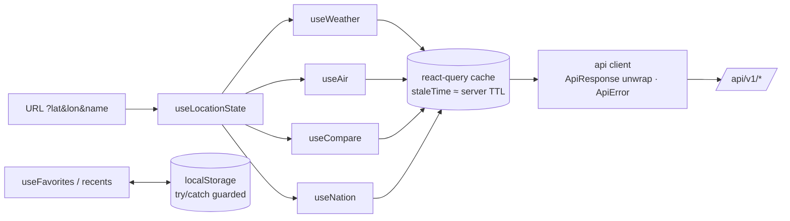
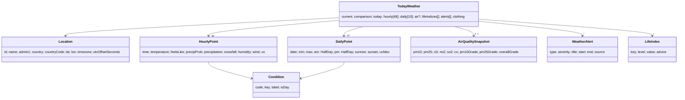
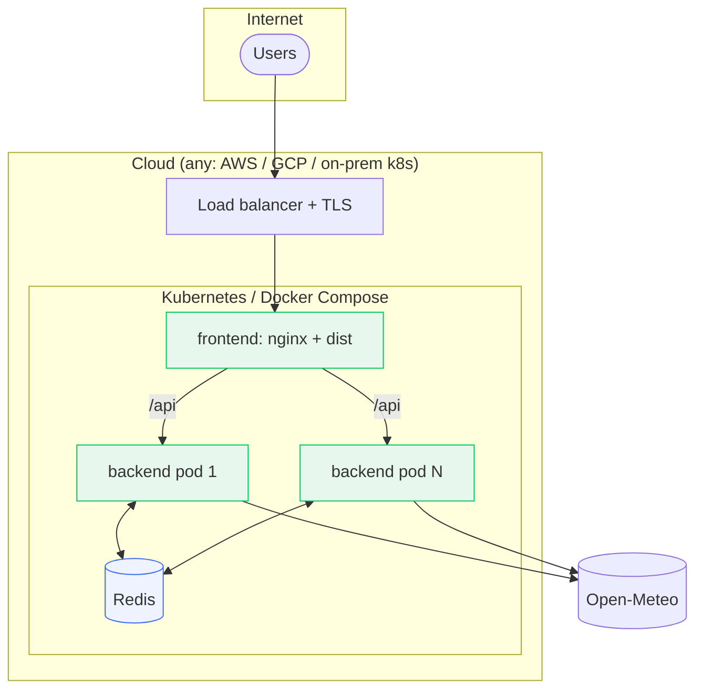

# Skycast: System Architecture (SA)

| | |
|---|---|
| Document | Solution / System Architecture |
| Version | 1.0 (MVP baseline) |
| Date | 2026-10-01 |
| Inputs | [BA.md](./BA.md) (requirements FR-*, NFR-*, BR-*) |
| Contract | [`shared/contract.ts`](../shared/contract.ts) |

---

## 1. Architectural drivers

| Driver | Source | Architectural response |
|---|---|---|
| Glanceable Home in one round trip | FR-H*, NFR-01 | **BFF aggregate** endpoint `/weather` returns current, hourly, daily, air, indices, alerts and clothing in one response |
| Upstream quotas and outages | NFR-02, NFR-07, Risk #1 | **Cache-aside + single-flight + stale-while-error + mock fallback** behind provider ports |
| Swap or add national providers later (NAMEM, KMA, AirKorea) | Roadmap Phase 2 | **Hexagonal (ports and adapters)** provider layer; the domain never sees vendor JSON |
| Business rules must be exact and auditable | BR-01…BR-08 | Pure **domain** functions with full unit tests; thresholds held as data |
| One typed contract across the team | NFR-09 | `shared/contract.ts`, imported type-only by both tiers |
| Horizontal scale, cheap ops | NFR-03 | Stateless Node containers; Redis-compatible cache interface; static SPA on a CDN |

---

## 2. C4 Level 1: System context



## 3. C4 Level 2: Containers



| Container | Responsibility | Tech | Scales by |
|---|---|---|---|
| Web SPA | UI, routing, client cache, favourites/recents (localStorage), geolocation | React 18, Vite, TypeScript, @tanstack/react-query, react-router, Leaflet, hand-rolled SVG charts | CDN |
| Edge (nginx) | Serves `dist/`, SPA fallback, proxies `/api` to the API, gzip, TLS termination | nginx:alpine | CDN / LB |
| API / BFF | Validation, aggregation, domain rules, caching, provider fallback, rate limiting, OpenAPI | Node 22, Fastify 5, zod, pino | Replicas behind LB (stateless) |
| Cache | Response and upstream cache with TTL, stale retention | In-memory LRU (MVP) → Redis 7 (prod) | Redis cluster |

## 4. C4 Level 3: API components (hexagonal)



**Dependency rule:** `http → services → (domain, ports)`. Adapters implement ports. The domain imports nothing from Fastify, fetch or vendor schemas, which keeps Phase-2 national providers to a matter of adding adapters.

### 4.1 Source layout

```
weather/
├── shared/contract.ts          # API types (single source of truth)
├── backend/src/
│   ├── config.ts               # env → typed config
│   ├── server.ts               # entrypoint
│   ├── http/                   # buildApp(deps), routes, schemas, error handler
│   ├── services/               # Weather/Air/Compare/Nation/Location services
│   ├── domain/                 # pure business rules (BR-01..08)
│   ├── providers/              # ports + open-meteo/* + mock/* + fallback
│   ├── cache/                  # Cache interface, LRU+TTL, single-flight
│   └── data/cities.ts          # region catalogues (mn, kr, world)
├── frontend/src/
│   ├── api/                    # typed client + react-query hooks
│   ├── pages/                  # Home, Air, Compare, Map
│   ├── components/             # cards, icons, charts
│   ├── hooks/ lib/ styles/
└── docker-compose.yml
```

---

## 5. Runtime views

### 5.1 `GET /api/v1/weather?lat&lon`: cache miss, upstream rate-limited



### 5.2 Failure semantics

| Situation | Behaviour | `meta` | HTTP |
|---|---|---|---|
| Cache hit (fresh) | Serve cached value | as stored | 200, `X-Cache: HIT` |
| Miss, upstream OK | Fetch, compute, store | `mock:false` | 200, `MISS` |
| Miss, upstream 429/5xx/timeout, `PROVIDER_MODE=auto` | Mock fallback | `mock:true` | 200, `MISS` |
| Expired entry, upstream fails | Serve last good value (≤ 6 h) | `stale:true` | 200, `STALE` |
| Air provider fails during `/weather` | `air: null`; rest of payload served | unchanged | 200 |
| `PROVIDER_MODE=live` and upstream fails, nothing cached | Error | n/a | 503 `UPSTREAM_UNAVAILABLE` |
| Invalid params | Error | n/a | 400 `BAD_REQUEST` |
| Client exceeds rate limit | Error | n/a | 429 `RATE_LIMITED` |

### 5.3 Client data flow



---

## 6. API design

REST, JSON, versioned path `/api/v1`. All success bodies are `ApiResponse<T> = { data: T, meta: ApiMeta }`. All errors are `{ error: { code, message } }`. Types live in [`shared/contract.ts`](../shared/contract.ts). OpenAPI is served at `/api/v1/openapi.json`.

| Method & path | Purpose | Cache TTL | FR |
|---|---|---|---|
| `GET /health` | Liveness/readiness, provider mode, cache stats | none | NFR-08 |
| `GET /locations/search?q&limit` | Autocomplete | 24 h | FR-L1 |
| `GET /locations/reverse?lat&lon` | Geolocation → place | 24 h | FR-L2 |
| `GET /weather?lat&lon` | Home aggregate (BFF) | 10 min | FR-H1…H9 |
| `GET /air?lat&lon` | Air-quality report and legend scale | 30 min | FR-A1…A4 |
| `GET /compare?lat&lon&models` | Multi-model comparison and consensus | 60 min | FR-C1…C4 |
| `GET /nation?region` | City snapshots for grid and map | 15 min | FR-H10, FR-M* |
| `GET /regions` | Available regions | static | FR-M2 |

**Design decisions**

* **Coordinates, not ids, as the key.** Any point on Earth works. The cache key rounds to 2 decimals (~1.1 km), which bounds cardinality and raises the hit ratio.
* **Derived data is computed server-side** (indices, alerts, clothing, grades). Rules are then defined once, tested once, and identical for future native apps.
* **Grade thresholds are returned** in `/air.scale`, so the UI legend can never drift from server logic.
* **Nation snapshot uses one upstream call.** Open-Meteo accepts comma-separated coordinate lists, so N cities cost one request.

---

## 7. Data model (domain)



**Persistence:** the MVP stores nothing durable server-side (no PII; favourites live on the device, per NFR-05). Phase 2 adds PostgreSQL for `users`, `favorites`, `push_subscriptions` and `alert_rules`, plus a time-series store (TimescaleDB) if we archive observations.

---

## 8. Caching strategy

| Layer | Mechanism | TTL |
|---|---|---|
| Browser | react-query `staleTime` mirrors server TTL; `Cache-Control: public, max-age` | per endpoint |
| CDN (optional) | Honour `Cache-Control` for `/api` GETs keyed by full URL | per endpoint |
| API | Cache-aside, LRU (max 5k entries), **single-flight** request coalescing, **stale retention** 6 h for error fallback | §6 table |
| Upstream | Batched multi-coordinate requests (nation) | n/a |

Capacity estimate: 100k DAU × 6 views/day ≈ 600k views/day. With a ~1 km cache key and a 10-minute TTL, popular cities hit the cache more than 90 % of the time. Upstream calls run around 30–60k/day, which is **above the Open-Meteo free tier**, so a commercial plan (or self-hosted Open-Meteo, which is open source) is required before marketing launch. This is captured as risk #1 in the BA.

---

## 9. Security architecture

| Concern | Control |
|---|---|
| Input | zod schemas: numeric ranges, string length, enum `models`/`region`; reject unknown values with 400 |
| Abuse | `@fastify/rate-limit` 120 req/min/IP (configurable). Edge rate limit at nginx/CDN in production |
| CORS | Allow-list via `CORS_ORIGIN` |
| Transport | HTTPS only at the edge; HSTS |
| Headers | nginx: `X-Content-Type-Options`, `Referrer-Policy`, CSP (self + OSM tiles) |
| Secrets | No secrets in the MVP (Open-Meteo is keyless). Phase 2 API keys come from env / secret manager, never shipped to the client |
| Supply chain | Lockfiles committed, `npm ci` in Docker, minimal alpine images, non-root user |
| Privacy | Coordinates are not logged beyond the 2-decimal cache key. No cookies, no analytics in the MVP |

---

## 10. Deployment view



* **Local / single host:** `docker compose up` in `weather/` runs `frontend` (nginx :8080) and `backend` (:8787).
* **Production:** frontend `dist/` on a CDN (or the nginx image), backend as ≥ 2 replicas with HPA on CPU, readiness probe on `/api/v1/health`, Redis for the shared cache.
* **Config (12-factor):** `PORT`, `PROVIDER_MODE` (`auto|live|mock`), `CACHE_TTL_*`, `UPSTREAM_TIMEOUT_MS`, `CORS_ORIGIN`.

### 10.1 CI/CD pipeline (proposed)

```
push → lint + typecheck (both) → unit tests (domain, cache, adapters, routes, components)
     → build images → contract check (frontend tsc against shared/contract.ts)
     → deploy to staging → smoke (curl /health, /weather) → manual promote → prod
```

---

## 11. Quality attributes: scenarios and tactics

| Attribute | Scenario | Tactic | Verified by |
|---|---|---|---|
| Availability | Open-Meteo returns 429 for a whole day | Fallback decorator → mock (labelled); stale-while-error | Route test with throwing fake provider; observed live during dev |
| Performance | 1,000 concurrent opens of Ulaanbaatar after a TTL expiry | Single-flight means 1 upstream call | Cache unit test (concurrent `getOrLoad`) |
| Modifiability | Add the NAMEM provider | New adapter implementing `WeatherProvider`; select by region in the composition root | Ports/adapters boundary; services depend on interfaces only |
| Correctness | PM2.5 = 35 vs 36 changes the grade | Boundary unit tests on BR-01 | `air.test.ts` |
| Usability | 360 px phone | Mobile-first CSS; only the hourly strip scrolls horizontally | Playwright screenshots at 390 px |
| Observability | Upstream error-rate spike | pino structured logs; `/health` cache stats; `X-Cache` header | Health route test |

---

## 12. Architecture decision records (ADR summary)

| ADR | Decision | Alternatives | Rationale |
|---|---|---|---|
| 001 | **TypeScript end-to-end** with a shared type-only contract | OpenAPI codegen; GraphQL | Zero codegen step; compiler catches drift; OpenAPI still published for third parties |
| 002 | **BFF aggregate `/weather`** | Many fine-grained endpoints | One round trip for Home (NFR-01); rules centralised |
| 003 | **Fastify** | Express, NestJS | Speed, built-in schema/hooks, `inject()` for tests, light compared with Nest |
| 004 | **Hexagonal provider layer + fallback decorator** | Direct vendor calls in services | Phase-2 providers, testability, graceful degradation |
| 005 | **Deterministic mock provider** | Fail hard; static fixtures | Demo and dev continue when the quota is exhausted (observed during development); deterministic output keeps tests stable; labelled in the UI (FR-T2) |
| 006 | **Korean MoE air grades** | US EPA AQI | Benchmark parity with Naver; stricter for health; US AQI still returned (`usAqi`) |
| 007 | **Open-Meteo multi-model** for Compare instead of commercial providers | AccuWeather/TWC APIs | Free, transparent model provenance; commercial providers become adapters later |
| 008 | **Hand-rolled SVG charts**; Leaflet lazy-loaded | Chart.js/Recharts | Bundle budget (NFR-01), full design control |
| 009 | **No server-side user data in the MVP** | Accounts from day 1 | Privacy, faster launch; localStorage covers favourites |

---

## 13. Traceability (requirement → component)

| Requirement | Backend | Frontend |
|---|---|---|
| FR-H2 / BR-03 | `domain/comparison.ts`, forecast `past_days=1` | `CurrentCard` |
| FR-H5 / BR-07 | `domain/halfday.ts` | `WeeklyForecast` (AM/PM, range bar) |
| FR-H6 / BR-05 | `domain/lifeIndices.ts` | `LifeIndices` |
| FR-H7 / BR-04 | `domain/clothing.ts` | `ClothingCard` |
| FR-H8 / BR-02 | `domain/alerts.ts` | `AlertBanner` |
| FR-A* / BR-01 | `domain/air.ts`, `AirService` | `AirPage`, grade colours |
| FR-C* / BR-06 | `CompareService` | `ComparePage` |
| FR-M*, FR-H10 | `NationService`, `data/cities.ts` | `MapPage`, `NationGrid` |
| FR-T* | `meta` in every response, fallback decorator | Footer badges |
| NFR-02 | cache + fallback | error/retry states |

---

## 14. Phase-2 target architecture (delta)

* **Provider router:** chooses an adapter by country (`MN → NAMEM`, `KR → KMA`, default `Open-Meteo`), with the existing fallback chain behind it.
* **Ingestion worker:** polls official warning feeds every 5 min and writes them to Postgres. `alerts` merges `official` (priority) with `derived` alerts.
* **Notification service:** Web Push / FCM for favourite locations when warnings are issued.
* **Tiles service:** radar and satellite tiles (KMA, or RainViewer for global coverage) proxied and cached at the CDN.
* **i18n:** `mn`, `ko`, `en` bundles; labels in the contract become i18n keys.
